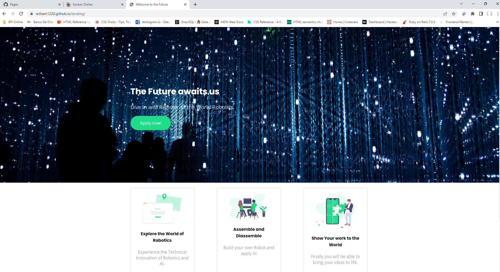

 

  

  <h3 align="center">Basic Landing Page</h3>

  

    Landing Page Design
     
     
    <a href="https://william1220.github.io/landing/">View Demo</a>
  

## About The Project

This a basic web page made from basic HTML and CSS. This is one of the Le Wagon Bootcamp Challenges during the bootcamp. 

## Built With

The Web Page is made of HTML and CSS. 

## Authors

[//]: contributor-faces
* **william1220** - *Graduate of Le Wagon Bootcamp* - [william1220](https://github.com/william1220/) - *I created It*
## Acknowledgements

* [Le Wagon ](https://www.lewagon.com/)
